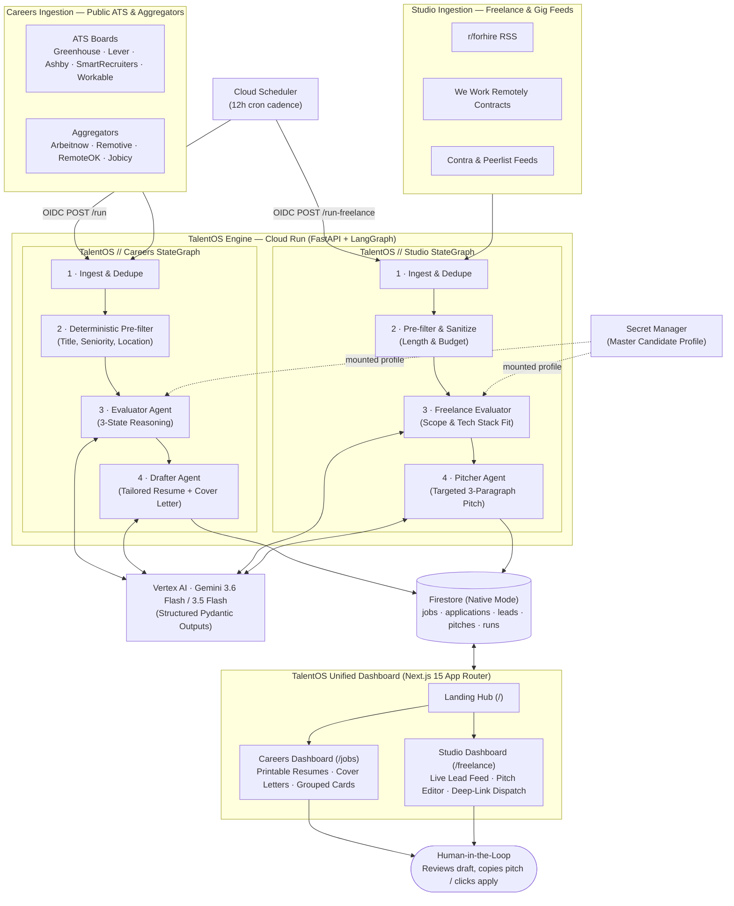

# TalentOS

An **AllStackLabs** product. Hackathon submission for the **Taskmaster** track: an autonomous opportunity intelligence platform featuring a dual-stream agent pipeline that discovers opportunities across public ATS and freelance feeds, checks each against hard/soft requirements via per-lead reasoning, and generates tailored, high-converting materials — all ending in concrete artifacts rather than chat replies.

---

## What's here

| Directory / File | Description |
|---|---|
| [`career-agent/`](career-agent/) | The core service. **Start with its [README](career-agent/README.md)** for setup, running, architecture, and caveats. |
| [`hackathon-project-plan.md`](hackathon-project-plan.md) | Design rationale, anti-automation guardrails, and track rubrics. |
| [`AGENTS.md`](AGENTS.md) | Architectural tenets, repo map, schemas, and developer guide for human and AI contributors. |

---

## Architecture: Dual-Stream Autonomous Opportunity Pipeline



---

## Core Architectural Tenets

1. **The Model is NOT the Control Flow**: Ingestion, deduplication, deterministic pre-filtering, rate caps, and persistence are executed in standard Python (via LangGraph state graphs). The LLM is invoked only for qualitative judgment.
2. **Cheap Filters Before Expensive Evaluation**: Roughly ~91% of irrelevant listings are dropped deterministically before any Vertex AI invocation, with every dropped item accounted for by reason.
3. **Strict 3-State Qualification Logic**: Requirements are categorized as **MET**, **UNMET**, or **NOT STATED**. Silence in a job description is never treated as a rejection.
4. **Hard Anti-Automation & Platform Guardrails**: Direct bot submission to protected platforms is strictly forbidden. The system prepares reviewable artifacts; the final apply/send action is strictly reserved for the human.

---

## The Dual Pipelines

### 1. TalentOS // Careers (Full-Time Opportunity Pipeline)
* **Ingestion**: 4 public ATS platforms (Greenhouse, Lever, Ashby, SmartRecruiters) + direct company portals + 4 open aggregator feeds (~2,500 postings/run).
* **Board Scout**: Search-grounded ATS board discovery using Google GenAI Search Grounding with strict API validation.
* **Output Artifacts**: Print-ready tailored HTML resumes, targeted cover letters, email digests, and grouped review cards.

### 2. TalentOS // Studio (Freelance Client Pipeline)
* **Ingestion**: `r/forhire` RSS, We Work Remotely contracts, and Contra/Peerlist open feeds.
* **Fit Scoring**: Evaluates client pain points against freelancer service offerings, verified portfolio projects, and availability.
* **Output Artifacts**: Tailored 3-paragraph problem-solving client pitches with suggested rates and one-click deep-link send assistance.

---

## Tech Stack & Google Cloud Ecosystem

* **Agent Framework**: Google ADK (`google.adk`) with isolated per-job `InMemorySessionService`.
* **State Machine & Orchestration**: LangGraph (`langgraph`).
* **Foundation Models**: Gemini 3.6 Flash & Gemini 3.5 Flash served via Vertex AI (`GOOGLE_CLOUD_LOCATION=global`).
* **Observability & Tracing**: Langfuse v2 with zero-overhead offline fallback.
* **Database & Memory**: Google Cloud Firestore (Native Mode, multi-tenant collections).
* **Compute & Scheduling**: Google Cloud Run (private OIDC service) + Google Cloud Scheduler (12h cadence).
* **Frontend**: Next.js 15 App Router, React 19, Tailwind CSS on Firebase App Hosting.

---

## Local Development & Testing

```bash
# 1. Run the hermetic offline test suite (235+ tests, ~6s)
cd career-agent
python -m pytest

# 2. Start the FastAPI backend
uvicorn main:app --reload --port 8080

# 3. Start the Next.js frontend dashboard
cd frontend
npm run dev
```
