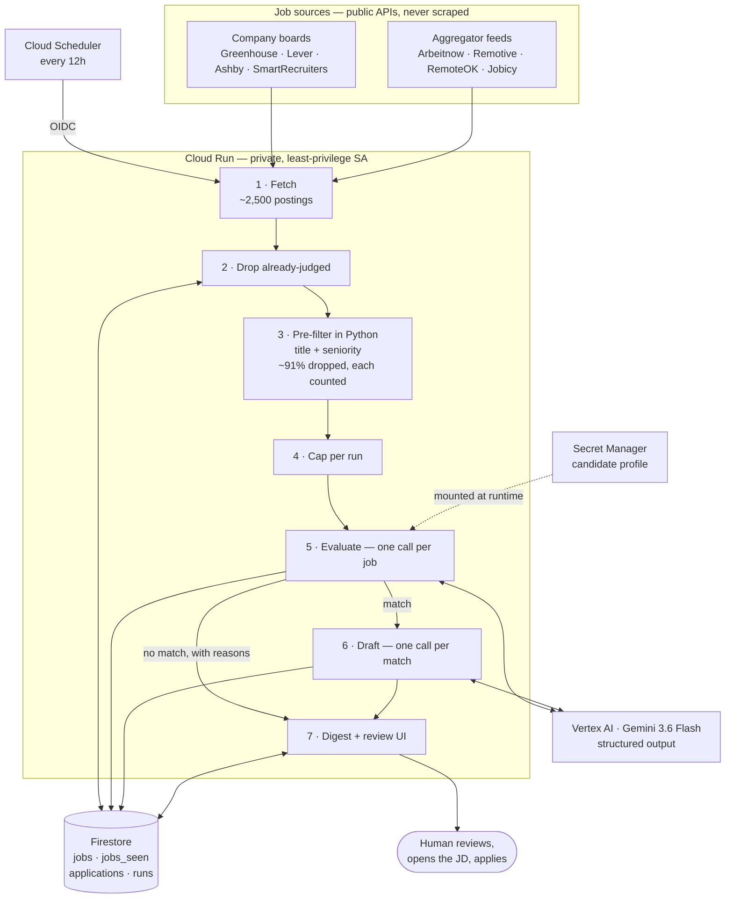

# All Things Agentic

Hackathon entry for the **Taskmaster** track: an autonomous job search agent
that finds postings across eight sources, checks each one against a candidate
profile, tells you exactly which requirement a rejection failed, and drafts
tailored application materials for the ones that fit.

It ends in a concrete artifact -- a digest and a reviewable draft -- rather
than a chat reply.

## What's here

| | |
|---|---|
| [`career-agent/`](career-agent/) | The pipeline. **Start with its [README](career-agent/README.md)** for setup, running, and the honest list of caveats. |
| [`hackathon-project-plan.md`](hackathon-project-plan.md) | Design rationale, the anti-automation guardrails that shaped the architecture, and scope decisions. |

## Architecture

Three things the diagram is meant to make obvious:

- **The model is not the control flow.** Steps 1–4 and 7 are ordinary Python.
  The model is called once per job to judge it and once per match to draft.
  Driving the whole loop as one conversation cost ~4× more and could silently
  skip a job.
- **The cheap filter runs before the expensive one.** Roughly 91% of postings
  are dropped deterministically before any model call, and every drop is
  counted by reason so nothing disappears silently.
- **The arrow stops at the human.** Nothing here submits an application.

## How it works

Cloud Scheduler triggers `POST /run` on Cloud Run. From there the control flow
is ordinary Python, not the model:

1. **Fetch** from Greenhouse, Lever, Ashby and SmartRecruiters company boards,
   plus the Arbeitnow, Remotive, RemoteOK and Jobicy aggregator feeds. All
   free, public and keyless -- roughly 2,500 postings a run.
2. **Pre-filter** deterministically on title and seniority. About 2,300 are set
   aside before any model call, and the counts are reported rather than hidden.
3. **Evaluate** each surviving job in its own isolated model call
   (Gemini 3.6 Flash on Vertex AI), sorting every requirement into met, unmet,
   or *not stated* -- a posting being silent about salary is not a rejection.
4. **Draft** tailored resume bullets and a cover letter for matches only.
5. **Digest and review** -- an emailed summary plus a read-only web UI showing
   each match with its JD link, why it matched, and what to verify.

State lives in Firestore, so runs are idempotent and a failed run never loses
a job.

**A human always performs the actual apply.** LinkedIn, Indeed, Glassdoor and
Wellfound are never scraped, and nothing is ever submitted on the user's
behalf -- see the guardrails section of the project plan for why that shaped
the architecture rather than being bolted on.

## Status

The Job Search pipeline runs end to end. A measured run evaluates 10 jobs for
about **$0.13** in roughly two minutes, with token usage and cost reported per
run and per model.

Still ahead: Cloud Run deployment, and the Freelance Client pipeline.

## Stack

Google ADK · Gemini 3.6 Flash via Vertex AI · Cloud Run · Firestore ·
Cloud Scheduler · FastAPI
