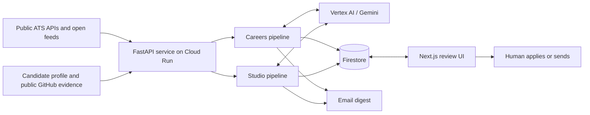
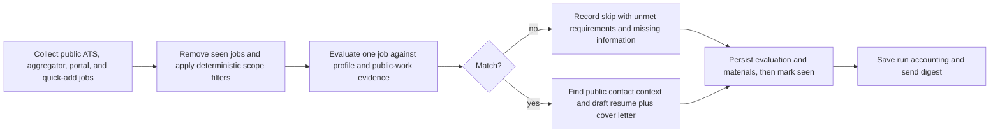
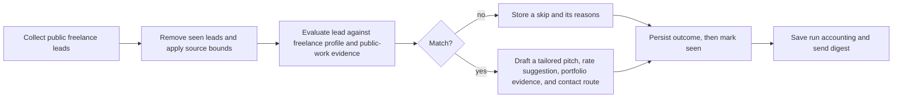

# TalentOS architecture

## Purpose and boundary

TalentOS is an opportunity-intelligence service with two workflows:

- **Careers** discovers public job listings, qualifies them against a candidate
  profile, and prepares materials for human review.
- **Studio** discovers public freelance leads, qualifies them against a
  freelancer profile, and prepares a client-specific pitch for human review.

It is not an application or outreach bot. It does not log in to, scrape, or
submit on protected platforms. A person performs the final apply or send action.

## System map

The diagram describes the implemented components. Cloud Run, Firebase App
Hosting, Cloud Scheduler, Secret Manager, and Langfuse configuration are
present in the repository, but their live status must be verified in the target
Google Cloud project before being described as deployed.

## Careers flow

1. `career_agent.tools.job_tools` collects from configured public sources.
   Supported ATS adapters are Greenhouse, Lever, Ashby, and SmartRecruiters;
   open aggregators are Arbeitnow, Remotive, RemoteOK, and Jobicy. The
   optional company-portal adapter supports public Workable, Workday CXS,
   employer RSS/sitemap, and `schema.org/JobPosting` sources.
2. `matching.prefilter` removes clear title, seniority, location, and work-mode
   mismatches before a model call and records a reason count for each removal.
3. The evaluator returns a structured `JobVerdict`. A requirement is `MET`,
   `UNMET`, or `NOT STATED`; silence is never a rejection.
4. Matches receive structured tailored-resume content and a cover letter. The
   system may add public hiring-contact context. Drafts may reorder or reword
   demonstrated experience, but must not invent skills, projects, employers,
   dates, or metrics.
5. An evaluation is stored before a dedupe marker is written. This preserves a
   retry path if a run fails partway through.

The default Career orchestration route is a LangGraph state graph when
`USE_LANGGRAPH_PIPELINE=true`; `pipeline.py` retains a linear fallback. The
public `/run` endpoint calls `pipeline.run_once`, which selects that path.

## Studio flow

Studio currently reads public r/forhire RSS, We Work Remotely contract feeds,
and Contra listings. Peerlist support exists but is disabled by default. The
freelance evaluator uses the same three-state logic: an unstated budget,
timeline, or other detail is missing information to clarify, not an automatic
rejection. A pitch contains the client problem, real relevant work, a rate
suggestion within the saved profile range, and a human-owned contact method.

## Control flow and model boundary

Ordinary Python handles fetching, source limits, deduplication, deterministic
filters, persistence, accounting, and dispatch. Gemini calls are scoped to one
listing or lead at a time for qualitative evaluation and drafting. This keeps
cost accounting and failure handling deterministic rather than allowing a
multi-turn model loop to decide which work completed.

## Data and tenancy

Firestore stores source records, per-user evaluations/materials, dedupe
markers, public-work enrichment, and run summaries. A Next.js server-side
proxy verifies Firebase identity and forwards a constrained
`X-TalentOS-User-Id` header to the private backend. The backend validates the
identifier and scopes reads/writes through a request-local user context.

`profile.json` is a local/bootstrap profile. Once a profile is saved to
Firestore, Firestore is the authority for that user. The production deployment
configuration mounts a profile from Secret Manager; never place a real resume,
SMTP password, API key, or service credential in version control.

## Security and product guardrails

- Cloud Run IAM is the primary runtime boundary. `RUN_AUTH_TOKEN` is an
  optional second check for run-triggering endpoints, not a replacement for
  IAM.
- Browser clients do not receive Cloud Run credentials; the frontend proxy
  obtains an identity token server-side.
- Public GitHub enrichment is optional, cached, excludes forks, and is used as
  evidence—not as permission to embellish a candidate's history.
- Quick-add accepts pasted text for restricted platforms such as LinkedIn,
  Indeed, Glassdoor, and Wellfound; it does not fetch them.
- A human owns application and outreach statuses such as `applied`, `sent`,
  and `replied`.

## Source of truth

| Concern | Code location |
| --- | --- |
| HTTP routes and auth dependencies | `career-agent/main.py` |
| Careers state graph | `career-agent/career_agent/graph.py` |
| Studio state graph | `career-agent/career_agent/freelance_graph.py` |
| Source adapters | `career-agent/career_agent/sources/` |
| Match rules | `career-agent/career_agent/matching.py` |
| Firestore persistence | `career-agent/career_agent/storage/firestore_store.py` |
| Frontend proxy and auth | `career-agent/frontend/src/lib/` and `src/app/api/` |
